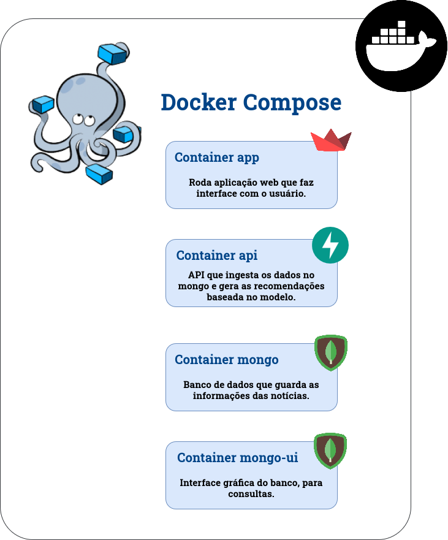
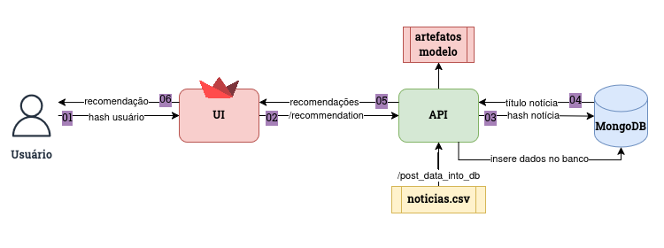
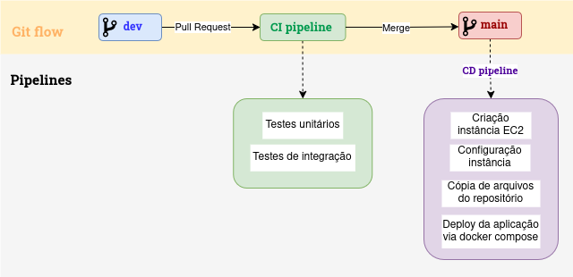

## Datathon - Tech Challenge #5 **🧩**

Grupo:
* Chrystian Remes
* Raiane Lima
* Thales Mendes

<br>

🎯Objetivo: Construção de um sistema de recomendação de notícias baseado em dados do G1 (Globo).

### **Tecnologias utilizadas 💡**

Nós utilizamos 4 containers em Docker para construção da solução:

* api: API de ingestão dos dados (CSV -> Mongo DB) e para recomendação de conteúdo.
* app: aplicação web streamlit que consulta a API e mostra as recomendações em interface amigável.
* mongo: utilizamos o Mongo DB para salvar os dados das notícias.
* mongo-express: interface gráfica do mongo db onde podemos fazer consultas.

<br>

A imagem abaixo traz a visão dos containers de forma mais detalhada.



<br>

A arquitetura da nossa solução pode ser vista na imagem abaixo.



<br>

Inicialmente, é preciso ingestar os dados no mongo através do endpoint da api, como mostrado na imagem acima. Após isso, a solução já estará pronta para ser colocada em produção.

**Passo a passo**

**01**: Usuário passa o hash via interface gráfica, na prática teríamos a página do G1 e isso seria passado de maneira automatizada para a API.

**02**: UI envia o dado do usuário para API no endpoint de recomendação.

**03**: API utiliza os artefatos do modelo e realiza o predict com as informações passadas via UI. Com a lista de recomendações, API consulta o banco através de uma função para recuperar os títulos das notícias a partir do _id (hash da notícia).

**04**: Banco retorna os títulos de acordo com o _id passado.

**05**: API retorna lista com as recomendações para a UI.

**06**: UI retorna a informação das notícias recomendadas de maneira amigável para o usuário.

### Estrutura de pastas **📂**

---

<br>

```
tech_challenge_5
├── .github/workflows
│   ├── cd.yml
│   └── ci.yml
├── api
│   ├── artifacts
│   ├── Dockerfile
│   ├── utils
|   ├── main.py
│   └── requirements.txt
├── app
│   ├── app.py
|   ├── Dockerfile
│   └── requirements.txt
├── docs
│   ├── arquitetura.png
│   ├── containers.png
│   ├── diagramas.drawio
│   └── deploy.png
├── recommendation
│   ├── artifacts
│   ├── devs_others
│   ├── utils
│   ├── 1_a_treating_train_data.ipynb
|   ... 
│   ├── 4_validating_model.ipynb
│   ├── config.json
│   └── requirements.txt
├── tests
├── docker-compose.yml
└── requirements.txt
```
<br>

* **.github/workflows**: Contém as pipelines de ci/cd que são executadas no github.
* **api**: Contém todos os códigos relacionados a API.
* **app**: Armazena os arquivos relativos à aplicação (streamlit).
* **docs**: Contém diagramas, imagens e demais arquivos para documentação
* **recommendation**: Possui todos os jupyter notebooks utilizados para as análises, treinamento e validação do modelo.
* **tests**: Pasta contendo todos os testes da API.
* **docker-compose.yml**: Arquivo responsável por orquestrar toda a criação dos containers da aplicação.
* **requirements.txt**: Arquivo com as dependências necessárias para rodar os testes na pipeline de CI.
  
<br>

### Início rápido (local) 🚀

---

1. Certifique-se de que você possui uma instalação Docker funcionando.
2. Vá na raiz do projeto (ou seja, na raíz de `tech_challenge_5`) e rode o comando `docker compose up --build -d`. A criação dos containers demora em torno de 5 minutos, mas pode variar dependendo das configurações do seu computador.
3. Certifique-se de que os containers estão com state `running`.
4. Crie uma pasta chamada `data` na raíz do repo e copie o .csv com a base das notícias.
5. Acesse a API para caregamento da base de notícias no mongo, no endereço `http://localhost/8000/docs`. No endpoint /post_data_into_db digite o caminho a seguir: `/app/data/nome_arquivo.csv`
6. Você também pode acessar a interface gráfica do mongo no endereço `http://localhost/8081/`, para conferir se o dataset foi ingestado. (login: root e senha: root)
7. Acesse a aplicação no endereço `http://localhost/8501/`. Insira o hash de um usuário e a interface irá lhe fornecer as recomendações.

<br>

### Deploy em nuvem ⚙️

Diagrama explicativo do workflow de CI/CD para deploy em nuvem.
<!--  -->


<br>

Na abertura do PR a pipeline de CI executa e roda o pytest para garantir que o código não irá subir quebrado para produção. Ao realizar o merge para a branch main a pipeline de CD é executada, criando uma instância EC2 e realizando o deploy do código nessa instância. Ao final da execução desta pipeline, é fornecido o link para acesso a interface do streamlit.

<br>

### Desenvolvimentos futuros ⚒️

- Aprofundamento da exploração dos dados para encontrar novas possíveis features (feature engineering). E.g. ter features de usuários e ou de notícias (tags) que poderiam ser usadas para clusterizar os users/items, melhorando a performance no cold-start.

- Reorganização do tratamento dos dados: algumas das etapas (limpezas dos "histories" que não estão no formato de hash) poderiam ser feitas em etapas anteriores.

- Aprofundar o conhecimento no uso da Lib LightFM, visando um melhor tuning dos hyper-parâmetros.

- Pipeline para retreino de modelo periodicamente, conforme novas notícias e usuários vão chegando a base (também atuando na melhora nos cenários de cold-start).
  
- Carregar os dados via bucket, dessa forma podemos integrar automaticamente as novas notícias no Mongo DB utilizando uma lambda function, por exemplo;
  
- Utilização de serviços de cloud mais robustos como ECS ou EKS, por questões de custo e tempo não avançamos mais na infraestrutura.

<br>

### Demo ⚒️

---

Clique [aqui]() e assita a demo.

